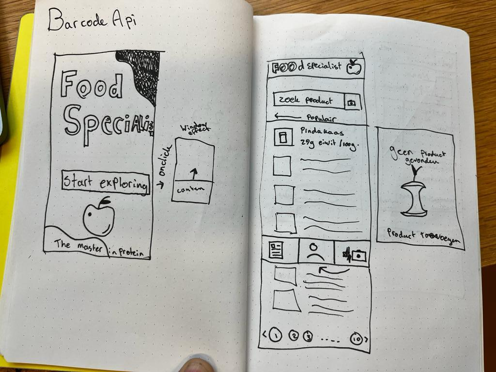

# :apple: Food Specialist

Ik heb mijn single page web applicatie (SPA) gemaakt op de Open-Food-Facts API. Deze API bevat ruim 15000 producten. Naast het werken met de API is het ook de bedoeling dat je een barcode kan scannen en hier een product mee kan vinden. 

## Process

De eerste les was het de bedoeling dat we de applicatie gingen uitschetsen en hier een breakdownschets van maken. Ik heb gedaan, mijn uiteindelijke schets ziet er zo uit:

Na het maken van de breakdown schets ging ik gelijk coderen. Ik heb de eerste week gelijk een prototype gemaakt van de foodspecialist. Dit zag er zo uit:

## States

Vervolgens was het de bedoeling om states toe te voegen aan de app. Ik heb deze states eerst uitgeschetst en vervolgens verwerkt in mijn concept. De schetsen zien er als volgt uit:

Vervolgens heb ik dit verwerkt in mijn concept:

## Barcode scanner

Het was ook de bedoeling dat we met de barcode API een product konden zoeken. Ik heb eerst een schets gemaakt hoe ik deze pagina eruit wil laten zien. Deze schets zag er als volgt uit:

Na dit te implementeren zag de site er zo uit:

## Routing

Om het allemaal nog uitgebreider te maken en de verschillende states beter uit te werken was het de bedoeling om iets van routing toe te voegen aan de site. Ik heb ervoor gekozen om dit te doen met een url met een `/?query=` of `/?id=`.
Ik heb dit voordat ik het ging uitwerken eerst geschetst op papier.

Ik heb bij het maken van de routes rekening gehouden met de popstate, je beland in de popstate als je een website 
teruglaad uit de opgeslagen cache.

## Laatste loodjes

Na alles te hebben geimplementeerd was het voor mij de tijd om alles helemaal fancy en mooi te maken. Ik heb uiteindelijk voor de search results een nieuwe schets gemaakt, en ook voor de detailpagina's. Daarnaast heb ik ook nog een aantal extra features toegevoegd.

## Eind versie

Ik ben ontzettend trots op mijn eindresultaat. Ik heb tijdens dit project kunnen oefenen met tal van interactieve componenten die ik graag wou leren. Dit zijn bijvoorbeeld:

- Een search 
- Een paginator 
- Data ophalen van API 
- Popstates
- Front-end routing 

---

Gemaakt door Stefan Radouane

Maart 2023